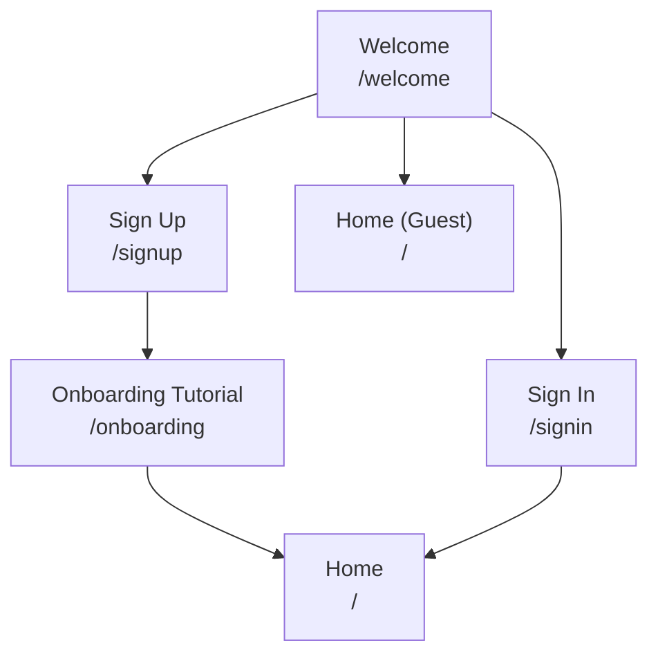
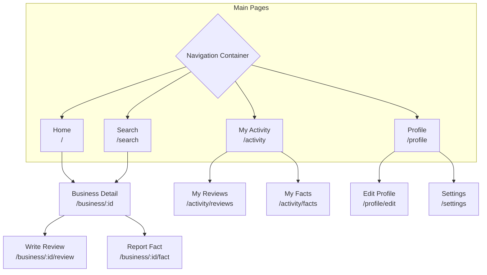
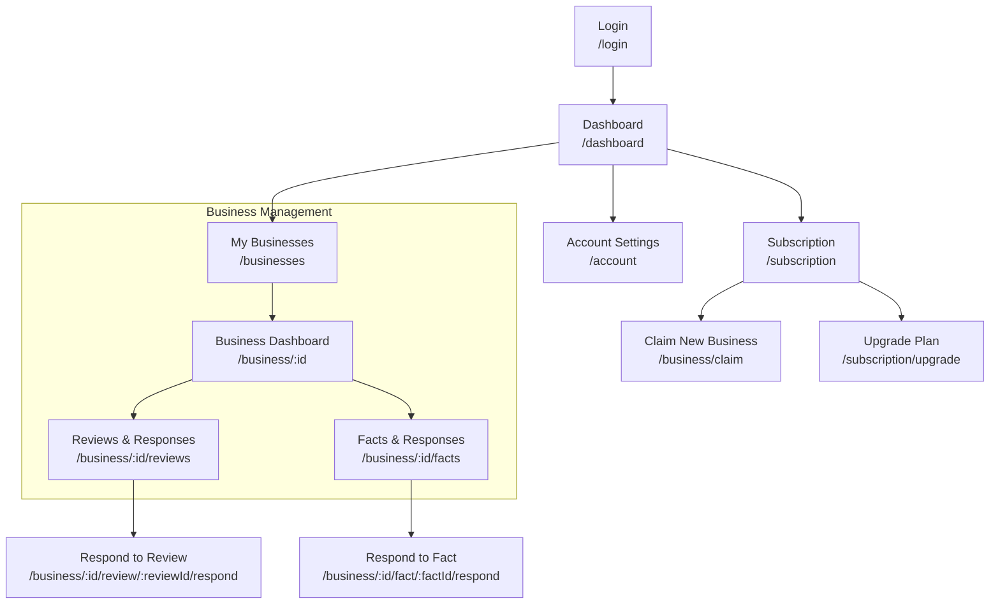
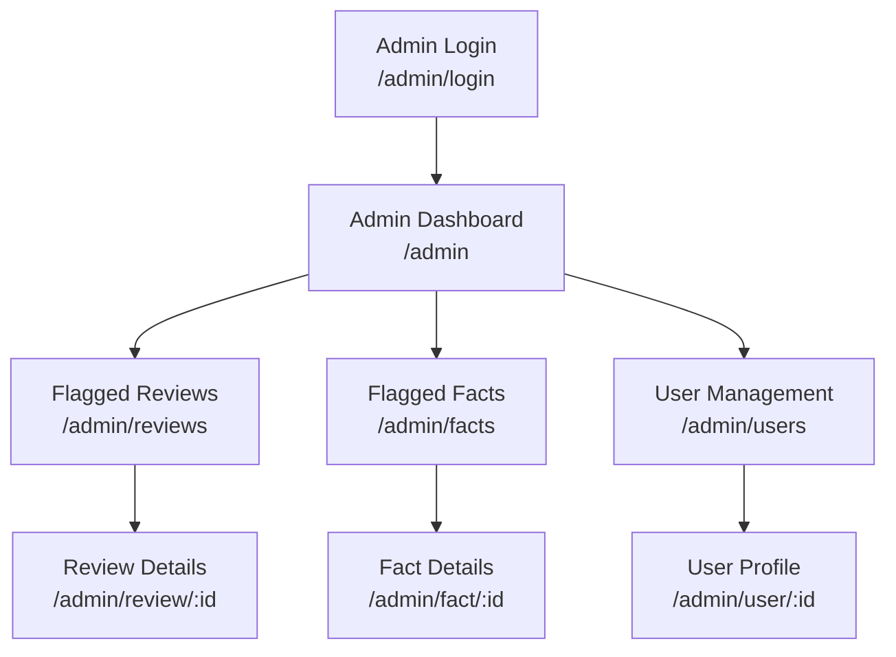

# User Flow — TruthRate

## Mobile Flow (Reviewer Experience)

### Authentication & Onboarding Flow

```mermaid
graph TD
  %% Entry point
  Welcome["Welcome<br/>/welcome"]

  %% Authentication
  Welcome --> SignUp["Sign Up<br/>/signup"]
  Welcome --> SignIn["Sign In<br/>/signin"]
  Welcome --> GuestMode["Home (Guest)<br/>/"]

  %% Sign up flow
  SignUp --> Onboarding["Onboarding Tutorial<br/>/onboarding"]
  Onboarding --> Home["Home<br/>/"]

  %% Sign in flow
  SignIn --> Home
```

### Main App Flow

```mermaid
graph TD
  %% Navigation Container
  NavContainer{Navigation Container}

  %% Core Pages
  subgraph "Main Pages"
    NavContainer --> Home["Home<br/>/"]
    NavContainer --> Search["Search<br/>/search"]
    NavContainer --> Activity["My Activity<br/>/activity"]
    NavContainer --> Profile["Profile<br/>/profile"]
  end

  %% Home to Business Detail
  Home --> BusinessDetail["Business Detail<br/>/business/:id"]

  %% Search to Business Detail
  Search --> BusinessDetail

  %% Business Detail flows
  BusinessDetail --> WriteReview["Write Review<br/>/business/:id/review"]
  BusinessDetail --> ReportFact["Report Fact<br/>/business/:id/fact"]

  %% Activity screens
  Activity --> MyReviews["My Reviews<br/>/activity/reviews"]
  Activity --> MyFacts["My Facts<br/>/activity/facts"]

  %% Profile screens
  Profile --> EditProfile["Edit Profile<br/>/profile/edit"]
  Profile --> Settings["Settings<br/>/settings"]
```

## Web Flow (Business Owner Dashboard)

```mermaid
graph TD
  %% Entry
  Login["Login<br/>/login"]

  %% Primary Pages
  Login --> Dashboard["Dashboard<br/>/dashboard"]

  %% Dashboard branches
  Dashboard --> BusinessList["My Businesses<br/>/businesses"]
  Dashboard --> Subscription["Subscription<br/>/subscription"]
  Dashboard --> Account["Account Settings<br/>/account"]

  %% Core Business Features
  subgraph "Business Management"
    BusinessList --> BusinessDashboard["Business Dashboard<br/>/business/:id"]
    BusinessDashboard --> ReviewsManagement["Reviews & Responses<br/>/business/:id/reviews"]
    BusinessDashboard --> FactsManagement["Facts & Responses<br/>/business/:id/facts"]
  end

  %% Response flows
  ReviewsManagement --> RespondToReview["Respond to Review<br/>/business/:id/review/:reviewId/respond"]
  FactsManagement --> RespondToFact["Respond to Fact<br/>/business/:id/fact/:factId/respond"]

  %% Subscription management
  Subscription --> ClaimBusiness["Claim New Business<br/>/business/claim"]
  Subscription --> UpgradePlan["Upgrade Plan<br/>/subscription/upgrade"]
```

## Admin Flow (Moderation Panel)

```mermaid
graph TD
  %% Admin Entry
  AdminLogin["Admin Login<br/>/admin/login"]

  %% Admin Dashboard
  AdminLogin --> AdminDashboard["Admin Dashboard<br/>/admin"]

  %% Moderation flows
  AdminDashboard --> FlaggedReviews["Flagged Reviews<br/>/admin/reviews"]
  AdminDashboard --> FlaggedFacts["Flagged Facts<br/>/admin/facts"]
  AdminDashboard --> UserManagement["User Management<br/>/admin/users"]

  %% Review moderation detail
  FlaggedReviews --> ReviewModeration["Review Details<br/>/admin/review/:id"]

  %% Fact moderation detail
  FlaggedFacts --> FactModeration["Fact Details<br/>/admin/fact/:id"]

  %% User management detail
  UserManagement --> UserDetail["User Profile<br/>/admin/user/:id"]
```
