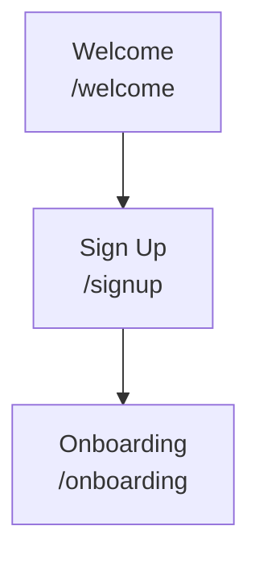
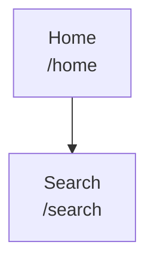
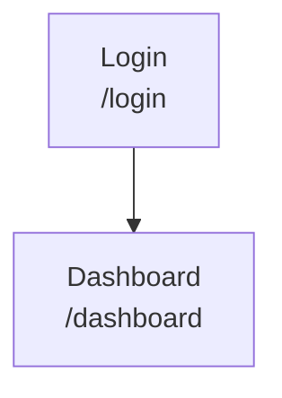
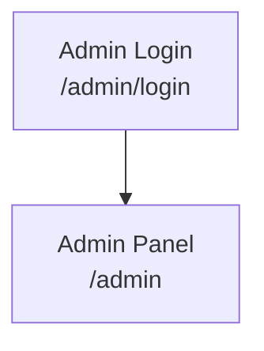

# User Flow — Demo Product

## Mobile Flow (Reviewer)

### Authentication & Onboarding Flow

```mermaid
graph TD
  Welcome["Welcome<br/>/welcome"]
  Welcome --> SignUp["Sign Up<br/>/signup"]
  SignUp --> Onboarding["Onboarding<br/>/onboarding"]
```

### Main App Flow

```mermaid
graph TD
  Home["Home<br/>/home"]
  Home --> Search["Search<br/>/search"]
```

## Web Flow (Business Owner)

```mermaid
graph TD
  Login["Login<br/>/login"]
  Login --> Dashboard["Dashboard<br/>/dashboard"]
```

## Admin Flow

```mermaid
graph TD
  AdminLogin["Admin Login<br/>/admin/login"]
  AdminLogin --> AdminPanel["Admin Panel<br/>/admin"]
```
